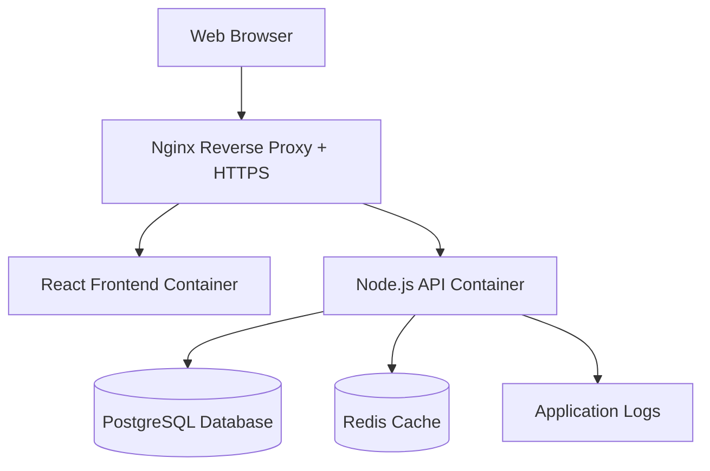

# Design Document

## Overview

The Family Coupon Manager is designed as a modern, containerized web application with a clear separation between frontend and backend services. The architecture follows microservices principles with a React-based frontend, Node.js/Express backend API, PostgreSQL database, and Redis for session management. The entire stack is containerized using Docker and deployed behind an Nginx reverse proxy with automatic HTTPS via Let's Encrypt.

## Architecture

### High-Level Architecture



### Technology Stack

**Frontend:**
- React 18 with TypeScript
- Material-UI (MUI) for responsive components
- React Query for API state management
- React Router for navigation
- Vite for build tooling

**Backend:**
- Node.js with Express.js framework
- TypeScript for type safety
- Prisma ORM for database operations
- Argon2 for password hashing
- jsonwebtoken for JWT handling
- express-rate-limit for rate limiting
- helmet for security headers

**Database & Caching:**
- PostgreSQL 15 for primary data storage
- Redis 7 for session storage and caching

**Infrastructure:**
- Docker & Docker Compose for containerization
- Nginx for reverse proxy and static file serving
- Let's Encrypt for automatic HTTPS certificates
- Ubuntu 22.04 LTS as target deployment platform

## Components and Interfaces

### Frontend Components

#### Authentication Components
- `LoginForm`: Handles user authentication with validation
- `RegisterForm`: User registration with password strength validation
- `AuthGuard`: Route protection component
- `AuthContext`: Global authentication state management

#### Coupon Management Components
- `CouponList`: Displays paginated list of coupons with filtering
- `CouponCard`: Individual coupon display component
- `CouponForm`: Create/edit coupon form with validation
- `CouponSearch`: Search and filter interface
- `CouponDetails`: Detailed view of individual coupon

#### Layout Components
- `AppLayout`: Main application layout with navigation
- `Header`: Application header with user menu
- `Sidebar`: Navigation sidebar (desktop)
- `MobileNav`: Mobile navigation drawer

### Backend API Endpoints

#### Authentication Endpoints
```
POST /api/auth/register
POST /api/auth/login
POST /api/auth/logout
POST /api/auth/refresh
GET  /api/auth/profile
```

#### Coupon Management Endpoints
```
GET    /api/coupons          # List coupons with filtering/search
POST   /api/coupons          # Create new coupon
GET    /api/coupons/:id      # Get specific coupon
PUT    /api/coupons/:id      # Update coupon
DELETE /api/coupons/:id      # Delete coupon
GET    /api/coupons/stats    # Get coupon statistics
```

### Service Layer Architecture

#### Authentication Service
- `AuthService`: Handles login, registration, token management
- `PasswordService`: Argon2 hashing and verification
- `JWTService`: Token generation, validation, and refresh

#### Coupon Service
- `CouponService`: Business logic for coupon operations
- `SearchService`: Advanced search and filtering logic
- `ValidationService`: Input validation and sanitization

#### Data Access Layer
- `UserRepository`: User data operations
- `CouponRepository`: Coupon CRUD operations
- `AuditRepository`: Security and action logging

## Data Models

### User Model
```typescript
interface User {
  id: string;
  email: string;
  passwordHash: string;
  firstName: string;
  lastName: string;
  role: 'admin' | 'member';
  isActive: boolean;
  createdAt: Date;
  updatedAt: Date;
  lastLoginAt?: Date;
}
```

### Coupon Model
```typescript
interface Coupon {
  id: string;
  code: string;
  description?: string;
  discountType: 'amount' | 'percentage';
  faceValue: number;
  expirationDate?: Date;
  usageLimit?: number;
  usageCount: number;
  status: 'active' | 'expired' | 'used' | 'disabled';
  createdBy: string;
  createdAt: Date;
  updatedAt: Date;
  tags?: string[];
}
```

### Database Schema

#### Users Table
```sql
CREATE TABLE users (
  id UUID PRIMARY KEY DEFAULT gen_random_uuid(),
  email VARCHAR(255) UNIQUE NOT NULL,
  password_hash VARCHAR(255) NOT NULL,
  first_name VARCHAR(100) NOT NULL,
  last_name VARCHAR(100) NOT NULL,
  role VARCHAR(20) DEFAULT 'member',
  is_active BOOLEAN DEFAULT true,
  created_at TIMESTAMP DEFAULT CURRENT_TIMESTAMP,
  updated_at TIMESTAMP DEFAULT CURRENT_TIMESTAMP,
  last_login_at TIMESTAMP
);
```

#### Coupons Table
```sql
CREATE TABLE coupons (
  id UUID PRIMARY KEY DEFAULT gen_random_uuid(),
  code VARCHAR(100) NOT NULL,
  description TEXT,
  discount_type VARCHAR(20) NOT NULL CHECK (discount_type IN ('amount', 'percentage')),
  face_value DECIMAL(10,2) NOT NULL,
  expiration_date DATE,
  usage_limit INTEGER,
  usage_count INTEGER DEFAULT 0,
  status VARCHAR(20) DEFAULT 'active' CHECK (status IN ('active', 'expired', 'used', 'disabled')),
  created_by UUID REFERENCES users(id),
  created_at TIMESTAMP DEFAULT CURRENT_TIMESTAMP,
  updated_at TIMESTAMP DEFAULT CURRENT_TIMESTAMP,
  tags TEXT[]
);
```

#### Audit Log Table
```sql
CREATE TABLE audit_logs (
  id UUID PRIMARY KEY DEFAULT gen_random_uuid(),
  user_id UUID REFERENCES users(id),
  action VARCHAR(50) NOT NULL,
  resource_type VARCHAR(50) NOT NULL,
  resource_id UUID,
  details JSONB,
  ip_address INET,
  user_agent TEXT,
  created_at TIMESTAMP DEFAULT CURRENT_TIMESTAMP
);
```

## Error Handling

### Frontend Error Handling
- Global error boundary for React component errors
- API error interceptors with user-friendly messages
- Form validation with real-time feedback
- Network error handling with retry mechanisms
- Loading states and error states for all async operations

### Backend Error Handling
- Centralized error handling middleware
- Structured error responses with consistent format
- Input validation using Joi or similar library
- Database error handling with appropriate HTTP status codes
- Security error logging without exposing sensitive information

### Error Response Format
```typescript
interface ErrorResponse {
  success: false;
  error: {
    code: string;
    message: string;
    details?: any;
    timestamp: string;
  };
}
```

## Security Implementation

### Authentication & Authorization
- Argon2id password hashing with appropriate salt rounds
- JWT tokens with short expiration (15 minutes) and refresh tokens (7 days)
- Role-based access control (admin vs member)
- Session invalidation on logout
- Rate limiting on authentication endpoints

### Input Validation & Sanitization
- Server-side validation for all API endpoints
- SQL injection prevention through parameterized queries (Prisma ORM)
- XSS prevention through input sanitization
- CSRF protection using SameSite cookies
- File upload restrictions (if implemented later)

### Security Headers & HTTPS
- Helmet.js for security headers
- HTTPS enforcement through Nginx
- Secure cookie settings
- Content Security Policy (CSP)
- HSTS headers for HTTPS enforcement

### Data Protection
- Database connection encryption
- Environment variable management for secrets
- Audit logging for sensitive operations
- Data retention policies
- Regular security updates for dependencies

## Testing Strategy

### Frontend Testing
- Unit tests for components using React Testing Library
- Integration tests for user workflows
- E2E tests using Playwright or Cypress
- Visual regression testing for responsive design
- Accessibility testing with axe-core

### Backend Testing
- Unit tests for services and utilities using Jest
- Integration tests for API endpoints
- Database integration tests with test containers
- Security testing for authentication flows
- Performance testing for search operations

### Test Coverage Goals
- Minimum 80% code coverage for critical paths
- 100% coverage for authentication and security functions
- Integration test coverage for all API endpoints
- E2E test coverage for primary user workflows

## Performance Optimization

### Frontend Performance
- Code splitting and lazy loading for routes
- Image optimization and lazy loading
- Caching strategies for API responses
- Bundle size optimization
- Progressive Web App (PWA) features

### Backend Performance
- Database indexing for search operations
- Redis caching for frequently accessed data
- Connection pooling for database connections
- API response compression
- Pagination for large datasets

### Database Optimization
- Indexes on frequently queried columns (email, coupon code, status)
- Query optimization for search operations
- Database connection pooling
- Regular maintenance and vacuum operations

## Deployment Architecture

### Container Configuration
- Multi-stage Docker builds for optimized images
- Separate containers for frontend, backend, database, and cache
- Health checks for all services
- Resource limits and requests
- Security scanning for container images

### Docker Compose Setup
```yaml
version: '3.8'
services:
  frontend:
    build: ./frontend
    environment:
      - REACT_APP_API_URL=/api
  
  backend:
    build: ./backend
    environment:
      - DATABASE_URL=postgresql://user:pass@db:5432/coupons
      - REDIS_URL=redis://redis:6379
      - JWT_SECRET=${JWT_SECRET}
  
  db:
    image: postgres:15
    environment:
      - POSTGRES_DB=coupons
      - POSTGRES_USER=user
      - POSTGRES_PASSWORD=${DB_PASSWORD}
    volumes:
      - postgres_data:/var/lib/postgresql/data
  
  redis:
    image: redis:7-alpine
    command: redis-server --requirepass ${REDIS_PASSWORD}
  
  nginx:
    image: nginx:alpine
    ports:
      - "80:80"
      - "443:443"
    volumes:
      - ./nginx.conf:/etc/nginx/nginx.conf
      - certbot_certs:/etc/letsencrypt
```

### Nginx Configuration
- Reverse proxy configuration for API and frontend
- Static file serving with appropriate caching headers
- SSL/TLS termination with Let's Encrypt certificates
- Rate limiting and security headers
- Gzip compression for static assets

### Monitoring & Logging
- Application logging with structured format (JSON)
- Error tracking and alerting
- Performance monitoring
- Health check endpoints
- Log rotation and retention policies